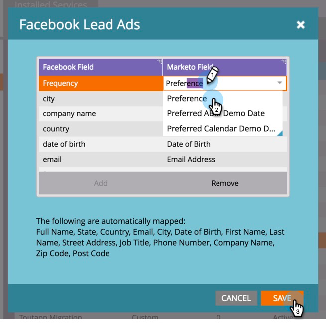

# Mappa anpassade fält till markering {#map-custom-fields-to-marketo}

Du kanske vill samla in mer än standardinformationen som lagras på Facebook som standard, till exempel hur ofta någon använder din onlinetjänst. Du kan uppnå detta genom att [skapa anpassade frågor](https://www.facebook.com/business/help/774623835981457?helpref=uf_permalink) i dina Facebook-annonser.

Men **Marketo börjar inte automatiskt samla in dessa data**. För att Marketo ska kunna börja hämta anpassade fältvärden måste du **mappa dessa anpassade fält till ett fält i Marketo.**

Så här konfigurerar du detta i området LaunchPoint i Admin.

>[!NOTE]
>
>**Administratörsbehörigheter krävs**

1. Gå till området Admin och klicka på **LaunchPoint**. Under Installerade tjänster kan du söka efter och redigera **Facebook-annonser**.

   

1. Klicka på **Nästa**.

   

1. Låt det behöriga kontot vara som det är - gör **inte** några ändringar. Klicka på **Nästa**.

   

1. Som tidigare lämnar du de markerade sidorna som de är - gör **inte** några ändringar. Klicka på **Nästa**.

   

1. Här mappar du det anpassade Facebook-fältet till ditt Marketo-fält. Klicka på **Lägg till.**

   

1. Ange namnet på det anpassade Facebook-fältet på den nya raden.

   

   >[!NOTE]
   >
   >Endast fält som har sparats i Facebook-formulärmallar visas som alternativ här.

1. Klicka i kolumnen **Marketo-fält**. Skriv för att söka efter fältet som du vill mappa till. När du har markerat ett fält klickar du på **Spara**.

   

   >[!NOTE]
   >
   >Om du inte redan har ett fält i Marketo att mappa Facebook-fältet till, lär du dig hur du [skapar anpassade fält](/help/marketo/product-docs/administration/field-management/create-a-custom-field-in-marketo.md).

>[!CAUTION]
>
>Du **måste** gå igenom den här processen för alla nya Facebook-fält för att Marketo ska kunna samla in data.
