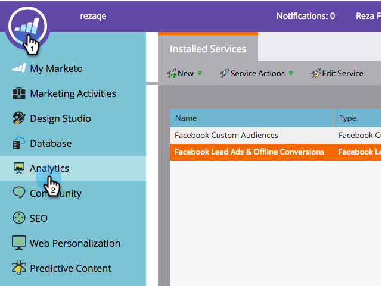

# Konfigurera offlinekonverteringar för Facebook {#set-up-facebook-offline-conversions}

Genom att skicka offlinekonverteringsdata tillbaka till Facebook för personer som skapats via Lead Ads kan ert annonsteam optimera sina annonskostnader bättre än någonsin. Så här ställer du in det.

>[!PREREQUISITES]
>
>* Du måste [konfigurera Facebook-annonser](/help/marketo/product-docs/demand-generation/facebook/set-up-facebook-lead-ads.md).
>* Du måste ha en godkänd modell i [Intäktscykelmodelleraren](/help/marketo/product-docs/reporting/revenue-cycle-analytics/revenue-cycle-models/understanding-revenue-models.md).

## Administratörskonfiguration {#admin-configuration}

1. Gå till Marketo **Admin**.

   

1. Gå till **LaunchPoint** och dubbelklicka på Facebook-tjänsten Lead Ads som du skapade tidigare.

   >[!NOTE]
   >
   >Om du inte har gjort det, gå vidare och [Konfigurera Facebook-annonser](/help/marketo/product-docs/demand-generation/facebook/set-up-facebook-lead-ads.md) och kom sedan tillbaka hit.

   

1. Om du vill kan du redigera **visningsnamnet** och inkludera offlinekonverteringar. Klicka på **Nästa**.

   

1. Markera **Aktivera offlinekonvertering** och klicka på **Nästa**.

   

1. Klicka på **Nästa**.

   

1. Klicka på **Spara**.

   

   Söt! Du är halvvägs färdig med att aktivera offlinekonverteringar för Facebook. Låt oss gå till Revenue Cycle Modeler för att kartlägga faserna.

   

## Konfiguration av intäktscykelmodelleraren {#revenue-cycle-modeler-configuration}

1. Gå till **Analytics**.

   

1. Markera modellen och klicka på **Redigera utkast**.

   

   >[!NOTE]
   >
   >För närvarande finns det 10 Facebook-händelser som du kan mappa intäktscykelsteg till:
   >
   >* Lägger till betalningsinformation
   >* Lägger till i kundvagnen
   >* Lägger till i önskelista
   >* Slutförda registreringar
   >* Utcheckningar har initierats
   >* Person
   >* Övriga
   >* Inköp
   >* Sökningar
   >* Innehållsvyer

1. Markera den scen som du vill mappa och välj sedan den Facebook-händelse som du vill mappa den till i listrutan **Facebook-konvertering**. Upprepa det här steget om du vill mappa alla faser i RCM till offlinekonverteringsfaser på Facebook.

   

1. Stäng modellen när du är klar med mappningen.

   

1. Godkänn din modell så är du klar!

   

   När Lead Ad-leads når de stadier du mappat skickas konverteringarna till Facebook för rapportering.

   >[!CAUTION]
   >
   >Kontrollera ditt Facebook-konto och se till att alla [annonser är associerade](https://www.facebook.com/business/url/?href=%2Fbusiness%2Fhelp%2Fwww%2F1776828022605281&amp;cmsid&amp;creative=link&amp;creative_detail=advertiser-help-center&amp;create_type&amp;destination_cms_id&amp;orig_http_referrer) till händelseuppsättningen Marketo Offline Conversions. Om de inte är det kanske inte annonseringen fungerar.

   >[!NOTE]
   >
   >Konverteringsdata offline skickas flera gånger dagligen från Marketo till Facebook.

>[!MORELIKETHIS]
>
>[Förstå offlinekonverteringar för Facebook](/help/marketo/product-docs/demand-generation/facebook/understanding-facebook-offline-conversions.md)
