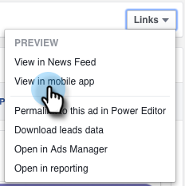

# Testa Facebook-annonser för mobilintegrering med Marketo {#test-facebook-lead-ads-for-mobile-integration-with-marketo}

När du har skapat din lead-annons bör du testa den!

>[!PREREQUISITES]
>
>Du måste [konfigurera Facebook Lead Ads-integrering](set-up-facebook-lead-ads.md).

1. Välj en kampanj, en annons i Facebook Power Editor och klicka på **Redigera**.
1. Klicka på länken **Visa på mobilapp** under **Länkar** .

   

1. Ett nytt meddelande skickas till det Facebook-konto som du har åtkomst till på den mobila enheten med det auktoriserade kontot. Klicka på **OK**.

   

1. Tryck på **Notifications (Meddelanden** ) i Facebook-mobilappen på din mobila enhet.

   

1. I Notifications (Meddelanden): tryck på **din annons för förhandsgranskning**.

   

1. Skicka in din testannonsenhet genom att trycka på Call To Action och fylla i det formulär du skapade.

   

   >[!NOTE]
   >
   >Detta är bara ett exempel som använder en Learn More Call To Action. Ditt lead-annonsenhetsanrop kan vara ett annat.

1. Det är här som magin händer! När du har skickat in formuläret [kan du skapa en smart lista i Marketo](../../../product-docs/core-marketo-concepts/smart-lists-and-static-lists/creating-a-smart-list/create-a-smart-list.md) som en del av ett program eller i den lead-databas som använder det **ifyllda Facebook-blankettfiltret** för annonser. Ange formulärets namn för lead-annons för det formulär du just skickade.

   

1. Klicka nu på fliken Leads för att kontrollera att synkroniseringen fungerar som den ska.

   

   Är det coolt eller?

>[!NOTE]
>
>**Relaterade artiklar**
>
>* [Aktivera/inaktivera Facebook-annonser](set-up-facebook-lead-ads.md)

>

