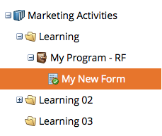

# Godkänn ett formulär {#approve-a-form}

Om du vill lägga till ett formulär på en av dina landningssidor måste det godkännas. Så här gör du.

## Godkänn ett formulär {#approve-a-form-1}

Så här godkänner du ett befintligt formulär som är klart att användas.

1. Gå till **Marknadsföringsaktiviteter**.

   

1. Hitta och markera formuläret.

   

1. Under **Formuläråtgärder** klickar du på **Godkänn**.

   

1. Lägg märke till den gröna bockmarkeringen?

   

   Den är godkänd och klar att läggas till [på en landningssida](/help/marketo/product-docs/demand-generation/landing-pages/understanding-landing-pages/approve-unapprove-or-delete-a-landing-page.md).

   >[!NOTE]
   >
   >Ändringar som görs efter godkännandet kan ta upp till fyra minuter att uppdatera inbäddade formulär.

## Godkänn ett formulär från redigeraren {#approve-a-form-from-the-editor}

Om du gör ändringar i ett formulär kan du godkänna sidan direkt från redigeraren.

>[!PREREQUISITES]
>
>* [Redigera ett formulär](/help/marketo/product-docs/demand-generation/forms/form-actions/edit-a-form.md)

1. Klicka på **Slutför**.

   

1. Klicka på **Godkänn och stäng**.

   

>[!NOTE]
>
>Kom ihåg att om du redigerar formuläret när det har godkänts måste du [godkänna landningssidan](/help/marketo/product-docs/demand-generation/landing-pages/understanding-landing-pages/approve-unapprove-or-delete-a-landing-page.md) för att se ändringarna.

Så ja! Så enkelt som möjligt.
