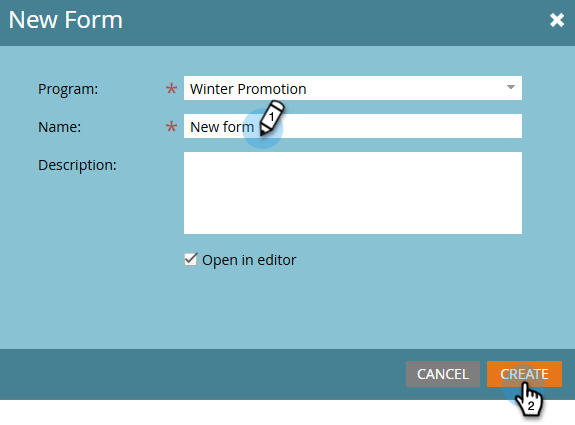

# Skapa ett formulär {#create-a-form}

Skapa och använd ett formulär på en landningssida för att generera nya namn eller hämta önskade data.

>[!NOTE]
>
>Läs vad Marketo Engage gör för att [skydda dina formulär](https://nation.marketo.com/t5/Product-Documents/Forms-Service-Enhancements/ta-p/303670#M1038).

1. Gå till **[!UICONTROL Marketing Activities]**.

   

1. Hitta önskat program. Högerklicka på den och välj **[!UICONTROL New Local Asset]**.

   

1. Välj **[!UICONTROL Form]**.

   

1. Ange ett formulär **[!UICONTROL Name]** och klicka på **[!UICONTROL Create]**.

   

>[!TIP]
>
>De flesta användare skapar ett nytt formulär för varje landningssida, men du kan också skapa ett formulär som ska användas med flera landningssidor. Det är helt och hållet upp till dig!

>[!MORELIKETHIS]
>
>* [Välj ett formulärtema](/help/marketo/product-docs/demand-generation/forms/creating-a-form/select-a-form-theme.md)
>* [Lägg till en FieldSet i ett formulär](/help/marketo/product-docs/demand-generation/forms/form-fields/add-a-fieldset-to-a-form.md)
