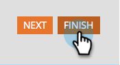

# Redigera en fältetikett i ett formulär {#edit-a-field-label-in-a-form}

Du kan ändra etiketten för ett formulär till vad som helst - du kan till och med använda en bild eller radera den helt! Så här gör du.

1. Gå till **[!UICONTROL Marketing Activities]**.

   

1. Markera formuläret och klicka på **[!UICONTROL Create draft]**.

   

   >[!NOTE]
   >
   >Om formuläret inte har godkänts klickar du på **Redigera utkast**.

1. Markera fältet och redigera sedan **[!UICONTROL Label]**. Fälten i Formulärinställningar motsvarar de etiketter du har angett.

   

   >[!TIP]
   >
   >Klicka på ikonen  för att öppna RTF-redigeraren.

1. Klicka på **[!UICONTROL Finish]**.

   

1. Klicka på **[!UICONTROL Approve and Close]**.

   

>[!NOTE]
>
>Glöm inte att [godkänna landningssidans utkast](/help/marketo/product-docs/demand-generation/landing-pages/understanding-landing-pages/approve-unapprove-or-delete-a-landing-page.md){target="_blank"} som skapas av formulärändringarna.
