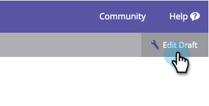

# Förhandsgranska ett formulär {#preview-a-form}

Innan du publicerar kan du se formuläret i den här snabba och enkla formulärförhandsgranskningen.

1. Gå till **Marknadsföringsaktiviteter**.

   

1. Hitta och markera formuläret.

   

1. Klicka på **Förhandsgranska** under **Formuläråtgärder**.

   

1. Formulärredigeraren öppnas i **förhandsgranskningsläge**.

   

1. Klicka på **Redigera utkast** om du vill gå tillbaka till **redigeringsläget**.

   

1. Växla enkelt tillbaka genom att klicka på **Förhandsgranska utkast**.

   

Var inte det enkelt? Nu vet du hur du förhandsgranskar formuläret när du gör ändringar.
