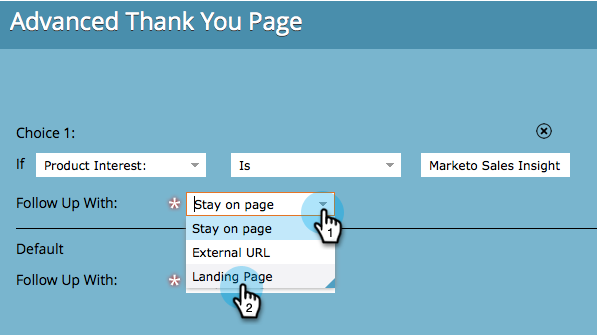

# Ange formulärets tacksida {#set-a-form-thank-you-page}

Vad händer när någon fyller i ett formulär? Var vidarebefordras de till? Så här konfigurerar du det.

## Redigera formulär {#edit-form}

1. Gå till **Marknadsföringsaktiviteter**.

   

1. Markera formuläret och klicka på **Redigera formulär**.

   

1. Under **Formulärinställningar** klickar du på **Inställningar**.

   

1. Bläddra nedåt till **Tack för sidan**.

## Stanna kvar på sidan {#stay-on-page}

Med alternativet Håll kvar på sidan ser du till att besökaren ser samma sida när formuläret har skickats.

1. Välj **Stanna kvar på sidan** för **Följ upp med**.

   

## Extern URL {#external-url}

Med inställningen Extern URL kan du definiera valfri URL som uppföljningssida. När användaren har skickat formuläret dirigeras de till den angivna URL:en.

1. Välj **Extern URL** för **Följ upp med**.

   

1. Ange den fullständiga URL:en.

   

>[!TIP]
>
>URL:en kan vara en fil som finns på en värdserver - om du gör det fungerar knappen &quot;Skicka&quot; som en &quot;Hämta&quot;-knapp.

## Landningssida {#landing-page}

Du kan välja vilken godkänd Marketo-landningssida som helst som uppföljning.

1. Ange **Följ upp med** till **Startsida**.

   

1. Hitta och välj den landningssida du vill använda.

   

## Dynamiska tacksidor {#dynamic-thank-you-pages}

Du kan lägga till flera alternativ och bygga in alternativ för att visa olika uppföljningar för personer beroende på deras svar.

1. Klicka på **Lägg till alternativ**.

   

1. Markera det fält som du vill övervaka svaret på.

   

   >[!TIP]
   >
   >Endast fält som lagts till i formuläret är tillgängliga för detta.

1. Markera den logiska operator som du vill använda.

   

1. Ange ett av de värden som användaren ska svara med.

   

1. Välj lämplig sida för typen **Följ upp med**.

   

1. Välj lämplig landningssida.

   

   >[!NOTE]
   >
   >Du måste ha skapat/godkänt dessa landningssidor i förväg.

1. Klicka på **+**-tecknet för att lägga till ett annat alternativ.

   

   >[!NOTE]
   >
   >Du kan lägga till flera alternativ. Om du lägger till för många kan det dock påverka formulärets inläsningshastighet, så lägg bara till det du behöver.

1. Gå igenom och konfigurera **Alternativ 2**.

   

   >[!TIP]
   >
   >Du kan blanda och matcha uppföljningstyper. Du kan använda en landningssida för ett val och en URL för en annan.

1. Ange en standardsida för alla andra svar.

   

1. Markera själva sidan och klicka på **Spara**.

   

   OK, ser bra ut!

   

1. Klicka på **Slutför**.

   

1. Klicka på **Godkänn och stäng**.

   

Bra jobbat!

