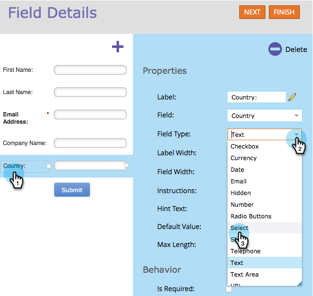

# Lägg till en landsväljarlista i ditt formulär {#add-a-country-picklist-to-your-form}

Följ dessa anvisningar för att konvertera landfältet till en listruta med en lista över alla länder.

1. Gå till **Marknadsföringsaktiviteter**.

   

1. Markera formuläret och klicka på **Redigera formulär**.

   

1. Klicka på **+**-tecknet.

   

1. Sök efter och välj **Land**.

   

1. Markera fältet **Land** och ändra **Fälttyp** till **Välj**.

   

1. **Redigera** värdena  **** för att lägga till listan över länder som användare kan välja mellan.

   

1. Klicka på **Avancerat** **Redigeraren**.

   

1. Markera och kopiera den här listan över länder:

   ```
   Afghanistan Albania Algeria Andorra Angola Antigua & Deps Argentina Armenia Australia Austria Azerbaijan Bahamas Bahrain Bangladesh Barbados Belarus Belgium Belize Benin Bhutan Bolivia Bosnia Herzegovina Botswana Brazil Brunei Bulgaria Burkina Burundi Cambodia Cameroon Canada Cape Verde Central African Rep Chad Chile China Colombia Comoros Congo Congo (Democratic Rep) Costa Rica Croatia Cuba Cyprus Czech Republic Denmark Djibouti Dominica Dominican Republic East Timor Ecuador Egypt El Salvador Equatorial Guinea Eritrea Estonia Ethiopia Fiji Finland France Gabon Gambia Georgia Germany Ghana Greece Grenada Guatemala Guinea Guinea-Bissau Guyana Haiti Honduras Hungary Iceland India Indonesia Iran Iraq Ireland (Republic) Israel Italy Ivory Coast Jamaica Japan Jordan Kazakhstan Kenya Kiribati Korea North Korea South Kosovo Kuwait Kyrgyzstan Laos Latvia Lebanon Lesotho Liberia Libya Liechtenstein Lithuania Luxembourg Macedonia Madagascar Malawi Malaysia Maldives Mali Malta Marshall Islands Mauritania Mauritius Mexico Micronesia Moldova Monaco Mongolia Montenegro Morocco Mozambique Myanmar (Burma) Namibia Nauru Nepal Netherlands New Zealand Nicaragua Niger Nigeria Norway Oman Pakistan Palau Panama Papua New Guinea Paraguay Peru Philippines Poland Portugal Qatar Romania Russian Federation Rwanda St Kitts & Nevis St Lucia Saint Vincent & the Grenadines Samoa San Marino Sao Tome & Principe Saudi Arabia Senegal Serbia Seychelles Sierra Leone Singapore Slovakia Slovenia Solomon Islands Somalia South Africa South Sudan Spain Sri Lanka Sudan Suriname Swaziland Sweden Switzerland Syria Taiwan Tajikistan Tanzania Thailand Togo Tonga Trinidad & Tobago Tunisia Turkey Turkmenistan Tuvalu Uganda Ukraine United Arab Emirates United Kingdom United States Uruguay Uzbekistan Vanuatu Vatican City Venezuela Vietnam Yemen Zambia Zimbabwe
   ```

1. Klistra in listan i redigeraren.

   

   >[!TIP]
   >
   >Redigera listan eller använd någon annan lista.

1. Klicka på **Spara**.

   

1. Klicka på **Slutför**.

   

1. Klicka på **Godkänn och stäng**.

   

   Snyggt gjort! När en person fyller i formuläret kan han eller hon nu välja bland de länder du angett.

   

Eftersom det var så enkelt, varför inte göra mer? Vad sägs om att dynamiskt visa fältet State när en användare väljer USA som land i listan? Läs artikeln nedan för att ta reda på hur du gör det.

>[!MORELIKETHIS]
>
>[Växla synlighet för ett formulärfält dynamiskt](/help/marketo/product-docs/demand-generation/forms/form-fields/dynamically-toggle-visibility-of-a-form-field.md)
