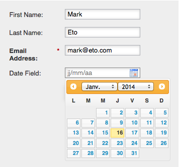

# Ändra språkinställning för ett formulär {#change-a-forms-locale}

När du arbetar med internationella formulär vill du visa datum/tid i rätt format. Marketo gör detta automatiskt åt dig, allt du behöver göra är att ställa in formulärets språkområde och ta hand om resten.

1. Gå till **[!UICONTROL Marketing Activities]**.

   

1. Markera formuläret och klicka på **[!UICONTROL Edit Form]**.

   

1. Klicka på **[!UICONTROL Form Settings]** under **[!UICONTROL Settings]**.

   

1. Välj önskad **[!UICONTROL Form Locale]**.

   

1. Klicka på **[!UICONTROL Finish]**.

   

1. Klicka på **[!UICONTROL Approve and Close]** om du vill använda och spara ändringarna.

   >[!NOTE]
   >
   >Formuläret ska vara godkänt för användning på landningssidor.

   

   >[!NOTE]
   >
   >Kom ihåg att [godkänna landningssidans utkast](/help/marketo/product-docs/demand-generation/landing-pages/understanding-landing-pages/approve-unapprove-or-delete-a-landing-page.md) som har skapats av formulärändringarna.

   Så där! Användarna kan se datum och tid visas på rätt språk.

   
