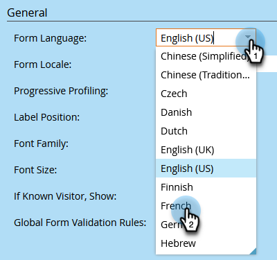

# Ändra språket i ett formulär {#change-the-language-of-a-form}

Lär dig hur du ändrar formulärets språk.

1. Gå till **Marknadsföringsaktiviteter**.

   

1. Markera formuläret och klicka på **Redigera formulär**.

   

1. Klicka **Formulärinställningar** och markera **Inställningar**.

   

1. Markera önskat **Formulärspråk**.

   

   TILLVAL: Välj språk/region för det valda språket.

   

1. Klicka **Slutför**.

   

1. Klicka **Godkänn och stäng** för att tillämpa och spara ändringar.

   

   >[!NOTE]
   >
   >Formuläret ska vara godkänt för användning på landningssidor.

   >[!TIP]
   >
   >Kom ihåg [godkänna landningssidan](/help/marketo/product-docs/demand-generation/landing-pages/understanding-landing-pages/approve-unapprove-or-delete-a-landing-page.md) utkast som har skapats av formulärändringar.

Formuläret återspeglar nu det språk du valt.

