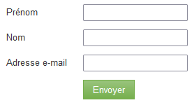

# Ändra språket i ett formulär {#change-the-language-of-a-form}

Lär dig hur du ändrar formulärets språk.

>[!IMPORTANT]
>
>Följ stegen i den här artikeln för att ändra språket i Marketo standardfält, samt formuleringen som används i etiketten Skicka-knapp. Det översätter inte [anpassade fält](/help/marketo/product-docs/administration/field-management/create-a-custom-field-in-marketo.md){target="_blank"}.

1. Gå till **marknadsföringsaktiviteter**.

   

1. Markera formuläret och klicka på **Redigera formulär**.

   

1. Klicka på **Formulärinställningar** och välj **Inställningar**.

   

1. Välj **formulärspråk**.

   

   VALFRITT STEG: Välj språk/region för det valda språket.

   

1. Klicka på **Slutför**.

   

1. Klicka på **Godkänn och stäng** för att tillämpa och spara ändringarna.

   

   >[!NOTE]
   >
   >Formuläret måste godkännas för användning på landningssidor.

   >[!TIP]
   >
   >Kom ihåg att [godkänna landningssidans](/help/marketo/product-docs/demand-generation/landing-pages/understanding-landing-pages/approve-unapprove-or-delete-a-landing-page.md)-utkast som skapas av formulärändringarna.

Formuläret återspeglar nu det språk du valt.

