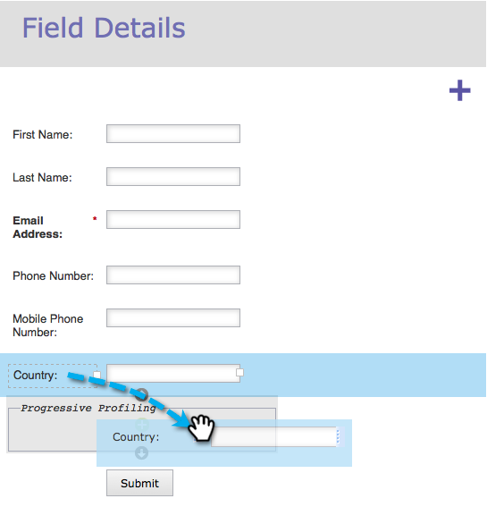

# Konfigurera progressiv profilering av formulär {#configure-form-progressive-profiling}

Korta formulär är bra. När någon kommer tillbaka till ett formulär kan du presentera nya fält och progressivt fylla i besökarens profil. Så här gör du.

>[!NOTE]
>
>För att den här funktionen ska fungera på rätt sätt måste formulärförifyllning vara aktiverat för synliga fält och [inaktiverat](http://docs.marketo.com/display/DOCS/Disable+Pre-fill+for+a+Form+Field) för dolda fält.

1. Gå till **Marknadsföringsaktiviteter** och **aktiviteter**.

   

1. Markera formuläret och klicka på **Redigera** **formulär**.

   

1. Klicka på **Inställningar** under **Formulärinställningar******.

   

1. Ange **Progressiv** **profilering** som **aktiverad**.

   

1. Nu ska vi konfigurera det. Gå till **Fältinformation** **Information**.

   
Dra och släpp alla fält som ingår i den progressiva profiluppsättningen.
   

1. När du har flyttat alla fält bör det se ut ungefär så här:

   

   >[!NOTE]
   >
   >Fälten utanför rutan **Progressiv** **profilering** visas alltid i formuläret, även om de är ifyllda.

1. Markera rutan **Progressiv** **profilering** .

   

   >[!CAUTION]
   >
   >Var försiktig när du använder obligatoriska fält i Progressiv profilering. Dessa fält kan fortfarande lämnas tomma om besökaren anger en ny e-postadress (som skulle skapa en ny person) efter att tidigare ha skickat data för de andra fälten, eftersom de då skulle ignoreras i det senaste formuläret.

1. Välj nu hur många tomma fält du vill att personer ska se i rutan **Progressiv** **profilering** vid varje given tidpunkt.

   

   >[!NOTE]
   >
   >**Exempel**
   >
   >
   >Om du väljer **Antal** **för** **tomma** **fält** som 1 visas följande första gången de ser det här formuläret:
   >
   >    
   >    
   >    * Förnamn (tomt)
   >    * Efternamn (tomt)
   >    * E-postadress (tom)
   >    * Telefonnummer (tomt)

   >    
   >    
   >Förutsatt att de fyller i alla fält, andra gången de besöker, kommer de att se:
   >
   >    
   >    
   >    * Förnamn (förifyllt)
   >    * Efternamn (förifyllt)
   >    * E-postadress (förifylld)
   >    * Mobiltelefonnummer (tomt)

   >    
   >    
   >Förutsatt att de fyller i mobiltelefonnumret kommer de tredje gången de besöker att se:
   >
   >    
   >    
   >    * Förnamn (förifyllt)
   >    * Efternamn (förifyllt)
   >    * E-postadress (förifylld)
   >    * Land (tomt)

1. Klicka på **Slutför**.

   

1. Klicka på **Godkänn och stäng**.

   

Snyggt jobb! Det arbete du just gjorde lönar sig.

Experimentera med den här funktionen och se till att testa den. Det är avancerat, men du kan göra formulären mycket dynamiska på det här sättet.
