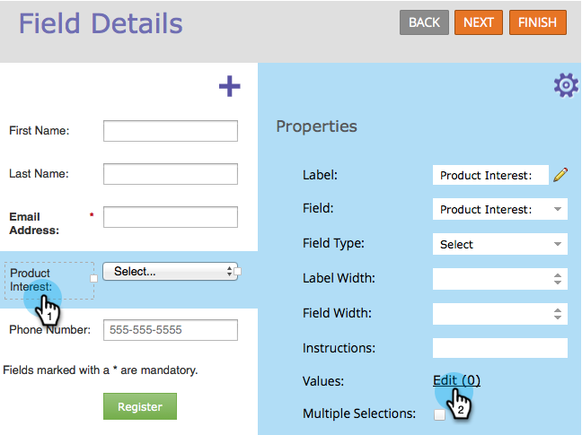
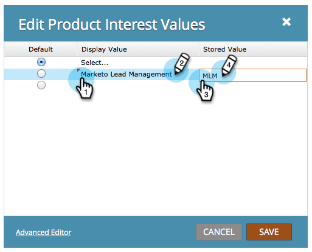

# Definiera värden i ett alternativfält eller markerat fält i ett formulär {#define-values-in-a-radio-or-selected-field-in-a-form}

När du har [angett att fälttypen](../../../../product-docs/administration/field-management/change-the-type-of-a-marketo-custom-field.md) ska vara en alternativknapp eller en markeringstyp, vill du definiera de värden som användaren kan välja mellan. Så här gör du.

1. Gå till **Marknadsföring** **Aktiviteter**.

   

1. Markera formuläret och klicka på **Redigera** **Formulär**.

   

1. Markera fältet och klicka på **Redigera**.

   

   >[!NOTE]
   >
   >Det första och standardvärdet är alltid &quot;Välj..&quot; Du kan redigera det själv. Om du ändrar standardalternativknappen till en annan rad, &quot;Välj..&quot; visas inte som ett alternativ i formuläret.

1. Klicka för att lägga till värdet.

   

   >[!NOTE]
   >
   >**Definition**
   >
   >
   >**Visningsvärde:** Vad som visas för besökaren.
   >
   >
   >**Lagrat värde:** Vad som spelas in i Marketo.

1. Lägg till så många värden du behöver och klicka sedan på **Spara**.

   >[!NOTE]
   >
   >Om du inte anger ett lagrat värde använder Marketo visningsvärdet och lagrar det.

   

   >[!TIP]
   >
   >Klicka på **Avancerad redigerare** om du vill kopiera/klistra in en lista med värden. Det kan spara tid i realtid.

1. Klicka på **Slutför**.

   

1. Klicka på **Godkänn och stäng**.

   

Superjobb! Du klarar dig jättebra. Läs mer om [formulär](http://docs.marketo.com/display/docs/forms).
