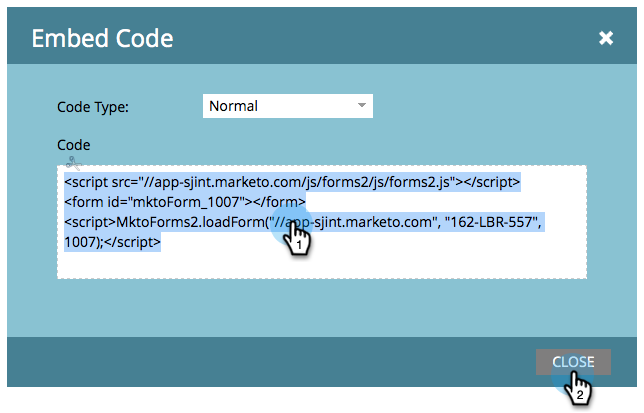

# Bädda in ett formulär på din webbplats {#embed-a-form-on-your-website}

Marketo låter er bädda in våra formulär på er egen webbplats. Så här får du åtkomst till inbäddningskoden.

1. Gå till **Marknadsföringsaktiviteter**.

   

1. Hitta och markera formuläret.

   

1. Under **Formuläråtgärder** klickar du på **Bädda in kod**.

   >[!NOTE]
   >
   >Formuläret måste godkännas för att **Embed Code**-objektet ska vara synligt/användbart.

   

   >[!CAUTION]
   >
   >**[Formulärförifyllnad fungerar inte när du använder formulärinbäddningskoden på dina egna sidor](/help/marketo/product-docs/administration/settings/edit-landing-page-settings.md)**   __ eller Marketo-landningssida. Förifyll formulär är endast avsett att fungera när formuläret används på en Marketo-landningssida via alternativet Infoga element.

1. Markera/kopiera inbäddningskoden och klicka sedan på **Stäng**.

   

>[!TIP]
>
>När koden har bäddats in på webbplatsen kommer alla ändringar av formuläret i Marketo att skickas till webbplatsen när formuläret godkänns. Du behöver inte göra fler ändringar i koden.

Ge nu bara inbäddningskoden till webbutvecklaren och låt dem lägga till den på webbplatsen.

>[!NOTE]
>
>Om din utvecklare vill anpassa utseendet eller få åtkomst till avancerade API-funktioner visar du sidan [Forms 2.0-utvecklare](https://developers.marketo.com/documentation/websites/forms-2-0/).

Bra jobbat! Vill du att [inbäddningskoden ska innehålla lightbox-kod](/help/marketo/product-docs/demand-generation/forms/form-actions/use-a-form-in-a-lightbox.md)? Det är lätt också!
