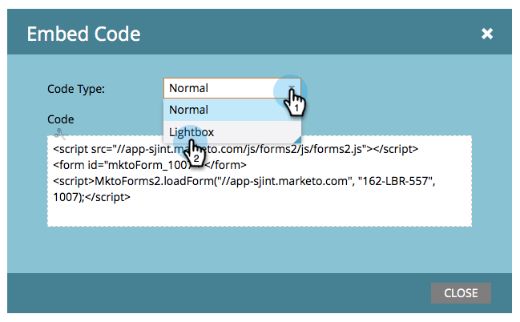

# Använda ett formulär i en ljuslåda {#use-a-form-in-a-lightbox}

En ljuslåda är en teknik som öppnar ett formulär framför innehållet när du vill att det ska visas. Så här gör du.

1. Gå till **[!UICONTROL Marketing Activities]**.

   

1. Hitta och markera formuläret.

   

1. Klicka på **[!UICONTROL Form Actions]** under **[!UICONTROL Embed Code]**.

   >[!NOTE]
   >
   >Formuläret måste godkännas för att det inbäddade kodobjektet ska vara synligt/användbart.

   

1. Ange **[!UICONTROL Code Type]** till **[!UICONTROL Lightbox]**.

   

1. Markera/kopiera koden och klicka på **[!UICONTROL Close]**.

   

Ge koden till webbutvecklaren och be dem lägga till den på webbplatsen.

Bra jobbat!
