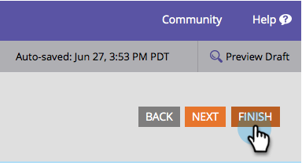

# Ändra formulärteckensnittsfamiljen {#change-the-form-font-family}

Google Fonts är grymt och vi har byggt in dem direkt i formulärredigeraren. Kolla in den!

>[!NOTE]
>
>Den här inställningen påverkar formuläretiketten, indatatexten och eventuell RTF-text.

1. Gå till **Marknadsföring** **Aktiviteter**.

   

1. Markera formuläret och klicka på **Redigera** **Formulär**.

   

1. Under **Formulär** **Inställningar** väljer du **Inställningar**.

   

1. Välj den **teckensnittsfamilj** du vill använda.

   >[!TIP]
   >
   >En hög med [Google Fonts](http://www.google.com/fonts) är tillgängliga för användning.

   

1. Klicka på **Slutför**.

   

1. Klicka på **Godkänn och stäng**.

   >[!NOTE]
   >
   >Formuläret ska vara godkänt för användning på landningssidor.

   

   >[!NOTE]
   >
   >**Påminnelse**
   >
   >
   >Kom ihåg att godkänna landningssidans utkast som skapats av formulärändringarna.

   

Se hur enkelt det var att byta teckensnittsfamilj i ett formulär? Nu när det är klart ska vi lära oss hur man ändrar teckenstorleken i formuläret.

>[!MORELIKETHIS]
>
>* [Ändra teckenstorlek för formulär](change-the-form-font-size.md)

>

