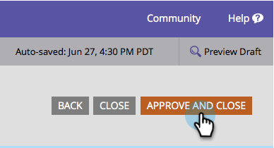

# Ändra formulärens teckenstorlek {#change-the-form-font-size}

Marketo gör det enkelt för er att anpassa formulärens utseende och känsla. En sak du kanske vill göra är att ändra teckenstorleken. Så här gör du.

>[!TIP]
>
>Den här inställningen påverkar formuläretiketten, indatatexten och texten för knappen Skicka.

1. Gå till **Marknadsföringsaktiviteter**.

   

1. Markera formuläret och klicka på **Redigera formulär**.

   

1. Under **Formulärinställningar** väljer du **Inställningar**.

   

1. Välj den **teckensnittsstorlek** du vill använda.

   

1. Klicka på **Slutför**.

   

1. Klicka på **Godkänn och stäng**.

   >[!NOTE]
   >
   >Formuläret ska vara godkänt för användning på landningssidor.

   

   >[!NOTE]
   >
   >Kom ihåg att godkänna landningssidans utkast som skapats av formulärändringarna.

   

Kakbit! Du förstår.
