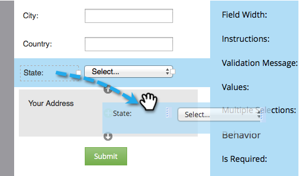

# Lägga till en FieldSet i ett formulär {#add-a-fieldset-to-a-form}

Fältuppsättningar är coola. De grupperar en massa fält tillsammans. Du kan styra ett helt block samtidigt!

1. Gå till **Marknadsföringsaktiviteter**.

   

1. Markera formuläret och klicka på **Redigera formulär**.

   

1. Klicka på **+** signera och välja **Fieldset**.

   

1. Välj **fältuppsättning** och ange **Etikett**.

   

1. Dra fälten till **fältuppsättning**.

   

1. Så här ska det se ut när du är klar.

   

Där har du den!

>[!TIP]
>
>Du kan dynamiskt dölja/visa hela fältuppsättningen beroende på ett annat fält. Läs mer om [regler för synlighet](/help/marketo/product-docs/demand-generation/forms/form-fields/dynamically-toggle-visibility-of-a-form-field.md).
