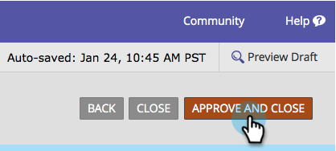

# Lägga till tipstext i ett formulärfält {#add-hint-text-to-a-form-field}

Tips och [instruktioner](add-tooltip-instructions-to-a-form-field.md) hjälper användarna att fylla i formulär. Så här lägger du till ett tips.

>[!NOTE]
>
>**Definition**
>
>Formulärtips **är** text i fältet som försvinner när besökaren börjar skriva i fältet.
>
>Formulärinstruktioner **är** små verktygstips som visas när besökaren hovrar över fältet.

1. Gå till **Marknadsföringsaktiviteter** och **aktiviteter**.

   

1. Markera formuläret och klicka på **Redigera** **formulär**.

   

1. Markera fältet och ange **tipsen** för **text**.

   

1. Klicka på **Slutför**.

   

1. Klicka på **Godkänn och stäng**.

   

   >[!NOTE]
   >
   >**Påminnelse**
   >
   >
   >Glöm inte att [godkänna landningssidans utkast](../../../../product-docs/demand-generation/landing-pages/understanding-landing-pages/approve-unapprove-or-delete-a-landing-page.md) som har skapats av formulärändringarna.

   

Kolla in den! Låt oss lägga till några [instruktioner](add-tooltip-instructions-to-a-form-field.md) nu.

>[!MORELIKETHIS]
>
>* [Lägga till verktygstipsinstruktioner i ett formulärfält](add-tooltip-instructions-to-a-form-field.md)

>

