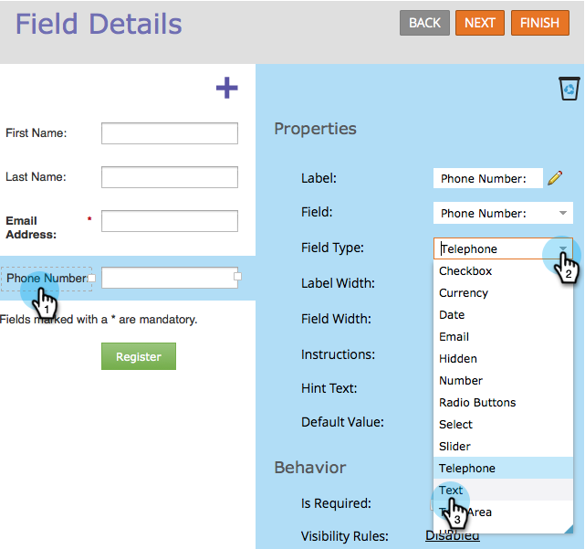
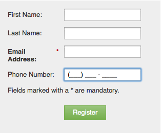

# Använda indatamaskering på ett fält i ett formulär {#apply-input-masking-to-a-field-in-a-form}

Du kan begränsa indata från besökaren med hjälp av en indatamask. Du kanske till exempel vill att besökarna bara ska ange telefonnummer i ett visst format.

1. Gå till **Marknadsföringsaktiviteter** och **aktiviteter**.

   

1. Markera formuläret och klicka på **Redigera** **formulär**.

   

1. Markera fältet och se till att **Fälttyp** **är inställt på** Text ****.

   >[!NOTE]
   >
   >Indatamaskering fungerar bara med **textfälttyper**.

   

1. Klicka på länken **Maskera** **indata** .

   

1. Ange indatamask och klicka på **Spara**.

   

   >[!NOTE]
   >
   >Var uppmärksam på maskeringsreglerna. Du kan begränsa inmatningen till siffror, bokstäver, både och/eller till och med begränsa antalet tecken som anges.

1. Klicka på **Slutför**.

   

1. Klicka på **Godkänn och stäng**.

   

   Kolla in den! Nu ber du besökaren att ange siffror i ett visst format.

   

   >[!NOTE]
   >
   >Fältet kanske inte visar fördefinierade områden enligt bilden ovan. Den kan vara tom tills besökaren börjar ange siffror, som sedan automatiskt kommer att följa det indataformat som du har definierat för fältet.

Ganska coolt, va?
