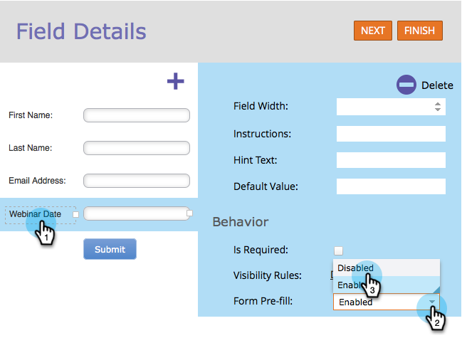

# Inaktivera förifyllning för ett formulärfält {#disable-pre-fill-for-a-form-field}

När en webbbesökare är känd (kodad) kommer Marketo-formulär att förifylla fält med deras information som standard. Så här gör du om du vill stänga av det här.

>[!NOTE]
>
>**Formulärets** förifyllning är aktiverat som standard. Inställningarna för förifyllning på landningssidnivå och förifyllning på administratörsnivå trumpar inställningen för formulärnivå:
>
>Form > Landing Page > Admin

1. Gå till **Marknadsföringsaktiviteter**.

   

1. Markera formuläret och klicka på **Redigera formulär**.

   

   >[!CAUTION]
   >
   >Förifyll formulär fungerar inte när du bäddar in ett formulär på dina egna sidor. Det fungerar bara på Marketo landningssidor.

1. Markera ett av fälten och ange **Formulärförifyllning** till **Inaktiverad**.

   

   >[!TIP]
   >
   >Du kan även inaktivera förifyllnad av formulär på landningssidnivå eller på adminnivå.

1. Klicka på **Slutför**.

   

1. Klicka på **Godkänn och stäng**.

   

Snyggt jobb!
