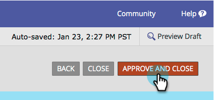

# Inaktivera förifyllning för ett formulärfält {#disable-pre-fill-for-a-form-field}

När en webbbesökare är känd (kodad) kommer Marketo-formulär att förifylla fält med deras information som standard. Så här gör du om du vill stänga av det här.

>[!NOTE]
>
>**Formulär - förifyll** är aktiverat som standard. Inställningarna för förifyllning på landningssidnivå och förifyllning på administratörsnivå trumpar inställningen för formulärnivå:
>
>Form > Landing Page > Admin

## Inaktivera förifyllning {#how-to-disable-pre-fill}

1. Gå till **Marknadsföringsaktiviteter**.

   

1. Markera formuläret och klicka på **Redigera formulär**.

   

   >[!CAUTION]
   >
   >Förifyll formulär fungerar inte när du bäddar in ett formulär på dina egna sidor. Det fungerar bara på Marketo landningssidor.

1. Markera ett av fälten och ange **Formulär - förifyll** till **Handikappade**.

   

   >[!TIP]
   >
   >Du kan även inaktivera förifyllnad av formulär på landningssidnivå eller på adminnivå.

1. Klicka **Slutför**.

   

1. Klicka **Godkänn och stäng**.

   

## Känsliga fält {#sensitive-fields}

När du [markera ett fält som känsligt](/help/marketo/product-docs/administration/field-management/mark-a-field-as-sensitive.md), som förhindrar att dess värden fylls i i i förväg, visas i alternativet Förifyll.

