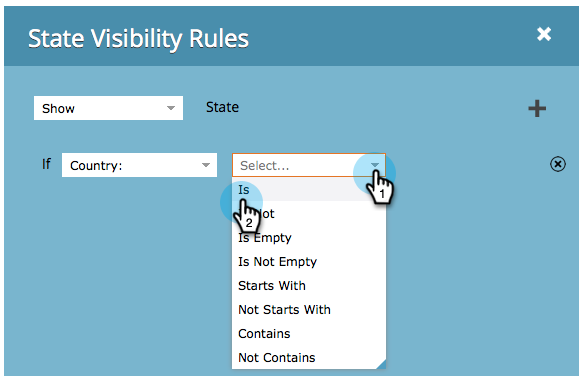

# Växla synlighet för ett formulärfält dynamiskt {#dynamically-toggle-visibility-of-a-form-field}

>[!PREREQUISITES]
>
>* [Lägg till en landsväljare i formuläret](../../../../product-docs/demand-generation/forms/form-actions/add-a-country-picklist-to-your-form.md)

>

En bra egenskap hos Marketo-formulär är att du dynamiskt kan dölja/visa formulärfält eller [fältuppsättningar](add-a-fieldset-to-a-form.md).

>[!NOTE]
>
>**Exempel**
>
>I det här exemplet döljer vi fältet **Delstat** såvida inte **Land** har valts som &quot;USA&quot;.

1. Gå till **Marknadsföringsaktiviteter** och **aktiviteter**.

   

1. Markera formuläret och klicka på **Redigera** **formulär**.

   

1. Markera det fält som du vill visa/dölja dynamiskt och klicka på länken för **Synlighetsregler** ****.

   

1. Sök efter och markera det fält som du vill skapa ett villkor runt.

   

1. Markera operatorn.

   >[!TIP]
   >
   >Det här är coolt eftersom du kan välja oskarpa matchningar som &quot;börjar med&quot;.

   

1. Markera de värden du vill söka efter och klicka sedan utanför listrutan.

   

   >[!TIP]
   >
   >Du kan markera flera värden genom att klicka på dem när listrutan är öppen. Du kan till exempel välja USA och Kanada.

   >[!NOTE]
   >
   >Vi har tidigare konverterat Land till fälttyp för plocklista och [lagt till alla länder som värden](../../../../product-docs/demand-generation/forms/form-actions/add-a-country-picklist-to-your-form.md).

1. Klicka på **Spara**.

   

Och det är allt! När man fyller i blanketten och väljer USA som land visas fältet State dynamiskt med de alternativ som anges.

>[!NOTE]
>
>**Djupdykning**
>
>Vill du veta mer om [formulär](http://docs.marketo.com/display/docs/forms)?

