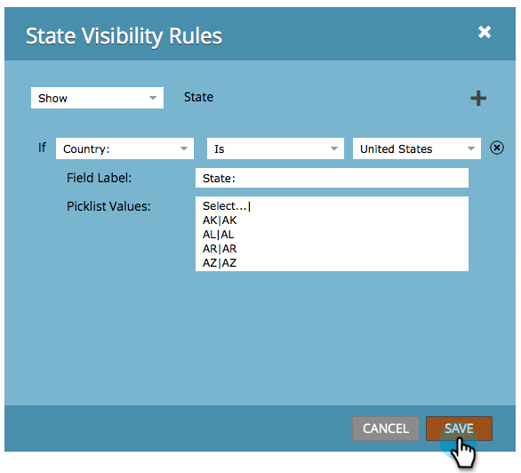

# Växla synlighet för ett formulärfält dynamiskt {#dynamically-toggle-visibility-of-a-form-field}

>[!PREREQUISITES]
>
>* [Lägg till en landsväljare i formuläret](/help/marketo/product-docs/demand-generation/forms/form-actions/add-a-country-picklist-to-your-form.md)

En bra egenskap hos Marketo-blanketter är att man dynamiskt kan dölja/visa blankettfält eller [fältuppsättningar](/help/marketo/product-docs/demand-generation/forms/form-fields/add-a-fieldset-to-a-form.md).

>[!NOTE]
>
>**Exempel**
>
>I det här exemplet kan vi dölja **Läge** fält såvida **Land** väljs som&quot;USA&quot;.

1. Gå till **Marknadsföringsaktiviteter**.

   

1. Markera formuläret och klicka på **Redigera formulär**.

   

1. Markera fältet som du vill visa/dölja dynamiskt och klicka på länken för **Synlighetsregler**.

   

1. Sök efter och markera det fält som du vill skapa ett villkor runt.

   

1. Markera operatorn.

   >[!TIP]
   >
   >Det här är coolt eftersom du kan välja oskarpa matchningar som &quot;börjar med&quot;.

   

1. Markera de värden du vill söka efter och klicka sedan utanför listrutan.

   

   >[!TIP]
   >
   >Du kan markera flera värden genom att klicka på dem när listrutan är öppen. Du kan till exempel välja USA och Kanada.

   >[!NOTE]
   >
   >Vi har tidigare konverterat Land till en plocklistefälttyp och [har lagt till alla länder som värden](/help/marketo/product-docs/demand-generation/forms/form-actions/add-a-country-picklist-to-your-form.md).

1. Klicka **Spara**.

   

Och det är allt! När man fyller i blanketten och väljer USA som land visas fältet State dynamiskt med de alternativ som anges.

>[!IMPORTANT]
>
>Formulärfältets beteende fungerar sömlöst när fältvärden ställs in/uppdateras via anpassat skript med [API-funktioner](https://developers.marketo.com/javascript-api/forms/){target="_blank"} i Forms 2.0.
>
>Villkorliga fält kanske inte fungerar som förväntat om fältvärden ändras av andra externa skript än JavaScript-API:t för Forms 2.0.
