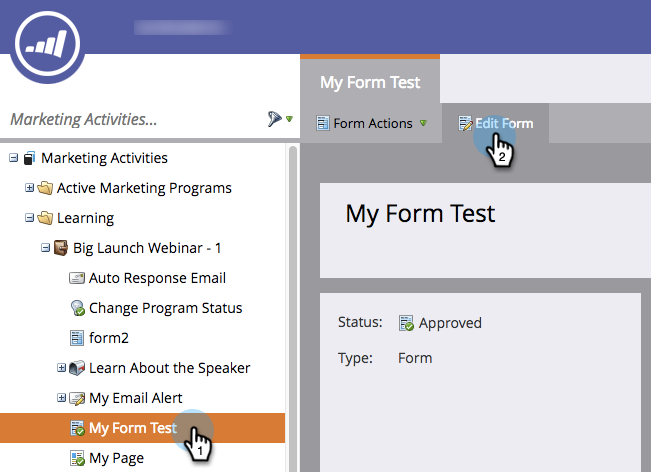

# Ändra ordning på fält i ett formulär {#reorder-fields-in-a-form}

Det är enkelt att ordna om fält i ett Marketo-formulär. Så här gör du.

1. Gå till **Marknadsföringsaktiviteter**.

   

1. Markera formuläret och klicka på **Redigera formulär**.

   

1. Dra och släpp fält i önskad ordning.

   

>[!TIP]
>
>Du kan också dra och släppa fälten bredvid varandra. Du kan göra kolumner!

Bra jobbat! Du skjuter i den här.
