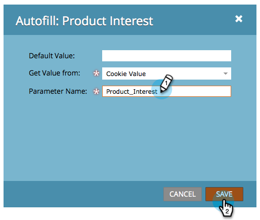

# Ange ett dolt formulärfältsvärde {#set-a-hidden-form-field-value}

Dolda fält fylls vanligtvis i dynamiskt. De visas inte för den som fyller i formuläret. Så här anger du värdet.

>[!PREREQUISITES]
>
>[Ange ett formulärfält som dolt](set-a-form-field-as-hidden.md)

## Markera fältet {#select-the-field}

1. Markera det dolda fältet i formuläret och klicka på **Redigera** för **Autofyll**.

   

## Använd standardvärde {#use-default-value}

Genom att välja Använd standardvärde kan du hårdkoda ett specifikt värde som alltid ska användas när formuläret skickas. Ange standardvärdet och klicka på Spara.

## URL-parameter {#url-parameter}

Om du vill hämta URL-parametrar (frågesträngar) från sidan som personen är på när du fyller i formuläret kan du använda **URL** - **parametrar** för att fylla i det dolda fältet.

>[!NOTE]
>
>Parametrar är ganska tekniska, eller hur? När man väl fått dem, är de kraftfulla. Den här [Wikipedia-sidan om frågesträngar](http://en.wikipedia.org/wiki/Query_string) är till viss hjälp.

1. Välj **URL-parameter** för **Hämta värdetyp**.

   

1. Ange **parameternamn** och klicka på **Spara**.

   

>[!TIP]
>
>Du kan ange ett standardvärde om URL-parametern inte hittas.

## Cookie-värde {#cookie-value}

Om du lagrar data i cookies kan du använda **cookie** - **värde** för att hämta data när formuläret skickas.

1. Välj **Cookie** - **värde** för **Hämta** **värde** **från**.

   

1. Ange det namn på cookie-parametern som du vill använda och klicka på **Spara**.

   

   >[!TIP]
   >
   >Du kan ange ett standardvärde om parametern/cookien inte hittas.

## Referensparameter {#referrer-parameter}

Om du vill hämta data från den sida som besökaren kom från innan du fyller i formuläret kan du använda **Referer** - **parameter**.

1. Ange **Hämta** **värde** **från** till **** referensparameter ****.

   

1. Ange det **parameternamn** som du vill fästa från hänvisarens URL och klicka på **Spara**.

   

   >[!TIP]
   >
   >Du kan ange ett **standardvärde** för **värde** om refererarparametern inte hittas.

1. Klicka på **Slutför**.

   

1. Klicka på **Godkänn och stäng**.

   

Söt! Du klarar dig ganska bra. Det finns mer att lära sig om [formulär](http://docs.marketo.com/display/docs/forms).
