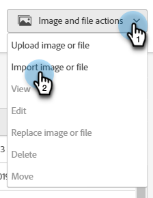

# Lägg till bilder och filer i Marketo {#add-images-and-files-to-marketo}

Det finns flera alternativ för att lägga till nya filer/bilder i din Images- och Files-databas.

## Överför bild eller fil {#upload-image-or-file}

1. Gå till **Design Studio**.

   

1. Välj **[!UICONTROL Images and Files]**

   

1. Klicka på **[!UICONTROL Image and file actions]** nedrullningsbar meny och välj **[!UICONTROL Upload image or file]**.

   

1. Dra och släpp bilden/filen eller bläddra till datorn.

   

1. När resursen har valts klickar du **Överför**.

   

## Importera bild eller fil {#import-image-or-file}

Det finns tre alternativ för att importera en bild. Vi går igenom dem.

### Importera från webben {#import-from-the-web}

Text

1. Följ steg 1 och 2 [från ovan](#upload-image-or-file).

1. Klicka på **[!UICONTROL Image and file actions]** nedrullningsbar meny och välj **[!UICONTROL Import image or file]**.

   

1. Välj **Webb** alternativ.

   

1. 

PICC

### Importera från ruta {#import-from-box}

Text

1. Följ steg 1 och 2 [från ovan](#upload-image-or-file).

1. Klicka på **[!UICONTROL Image and file actions]** nedrullningsbar meny och välj **[!UICONTROL Import image or file]**.

PICC

1. Text

### Importera från Adobe Experience Manager {#import-from-adobe-experience-manager}

Text

1. Följ steg 1 och 2 [från ovan](#upload-image-or-file).

1. Klicka på **[!UICONTROL Image and file actions]** nedrullningsbar meny och välj **[!UICONTROL Import image or file]**.

PICC

1. Text

GAMMAL DOC...

Det är enkelt att lägga till flera bilder och filer samtidigt.

1. Gå till **Design Studio**.

   

1. Under **Nytt**, klicka **Överför bild** eller **Fil**.

   

1. Välj den mapp där du vill lagra bilderna eller filerna och klicka sedan på **Bläddra**.

   

   >[!NOTE]
   >
   >Den största storleken per fil är 100 MB.

1. Om du vill lägga till flera bilder och filer bläddrar du till rätt mapp på datorn och trycker på **Ctrl/Cmd** och klicka på varje fil som du vill lägga till och klicka sedan på **Öppna**.

   

1. Expandera **Filinformation** för att bekräfta att du har valt rätt bilder och sedan klicka på **Överför**.

   

   >[!NOTE]
   >
   >Om du vill ta bort alla köade filer före överföring klickar du på x:et bredvid filnamnet.

   >[!TIP]
   >
   >Marketo söker igenom alla filer innan de överförs. Infekterade filer hoppas över.

1. När överföringen är klar klickar du på **Slutför**.

   

1. Dina bilder kan nu användas i e-postkampanjer och på landningssidor.

   

Snyggt gjort!

>[!NOTE]
>
>Alla filtyper kan överföras medan Marketo endast hanterar de viktigaste bildtyperna (JPG, PNG, GIF, osv.) fungerar i vår e-postredigerare.

>[!MORELIKETHIS]
>
>[Ordna dina bilder och filer med hjälp av mappar](/help/marketo/product-docs/demand-generation/images-and-files/organize-your-images-and-files-using-folders.md)
