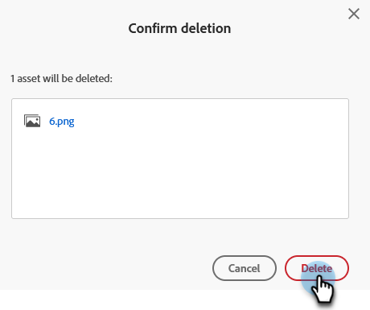

# Ta bort en överförd bild eller fil {#delete-an-uploaded-image-or-file}

Det går snabbt och enkelt att ta bort bilder eller filer.

>[!CAUTION]
>
>När bilderna har tagits bort tas de bort helt från Marketo Engage och kan inte återställas.

1. Gå till **[!UICONTROL Design Studio]**.

   

1. Välj **[!UICONTROL Images and Files]**

   

1. Sök efter och markera bilden/filen. Klicka på listrutan **[!UICONTROL Image and file actions]** och välj **[!UICONTROL Delete]**.

   

1. Kontrollera att du har valt rätt fil och klicka på **[!UICONTROL Delete]**.

   

   >[!NOTE]
   >
   >Assets tar inte bort om de används.

>[!MORELIKETHIS]
>
>* [Ersätt en överförd bild eller fil](/help/marketo/product-docs/demand-generation/images-and-files/replace-an-uploaded-image-or-file.md){target="_blank"}
>* [Sök efter överförda bilder och filer](/help/marketo/product-docs/demand-generation/images-and-files/search-uploaded-images-and-files.md){target="_blank"}
>* [Hitta URL-adressen till en överförd bild eller fil](/help/marketo/product-docs/demand-generation/images-and-files/find-the-url-of-an-uploaded-image-or-file.md){target="_blank"}
