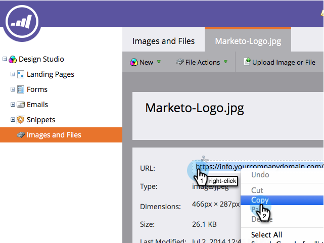

# Hitta URL:en för en överförd bild eller fil {#find-the-url-of-an-uploaded-image-or-file}

Söker du efter webbadressen (URL:en) till en bild eller fil som du har överfört? Marketo har dig täckt.

1. Gå till **Design Studio**.

   

1. Klicka på **Bilder** **och** **Filer** på den vänstra menyn och välj sedan den fil som du vill ha URL-adressen för.

   

1. URL:en **visas på informationssidan.** Högerklicka på **URL** och klicka på **Kopiera** på menyn som visas.

   

Ge dig själv en klappa på ryggen för ett väl utfört jobb!

>[!MORELIKETHIS]
>
>* [Ersätta en överförd bild eller fil](replace-an-uploaded-image-or-file.md)

>

