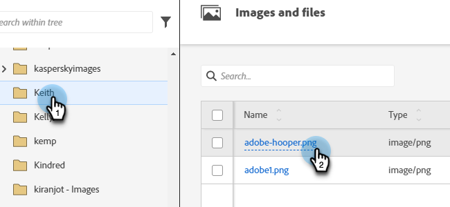
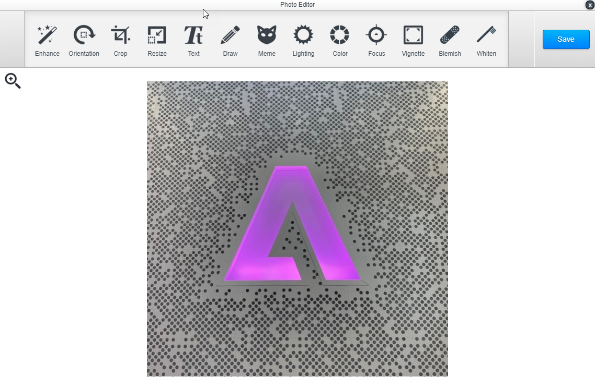

# Bildredigeraren {#image-editor}

Med bildredigeraren kan du göra snabba, ljusa redigeringar av dina bilder i Marketo Engage.

1. Gå till **[!UICONTROL Design Studio]**.

   

1. Leta reda på och markera bilden.

   

1. Klicka på **[!UICONTROL Edit Image]** -knappen.

   

1. Välj bland en mängd olika funktioner i verktygsfältet längst upp. Klicka **[!UICONTROL Save]** när det är klart.

   
