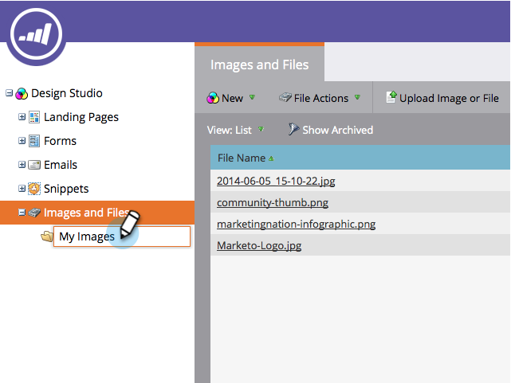

# Ordna dina bilder och filer med hjälp av mappar {#organize-your-images-and-files-using-folders}

När du skapar mappar kan du flytta bilder och filer, se bara den uppsättning bilder du vill ha och överföra direkt till en viss mapp.

1. Gå till **Design** **Studio**.

   

1. Högerklicka på** Bilder och filer** i den vänstra menyn och välj sedan **Ny mapp**.

   

1. När den nya mappen visas ger du den ett namn.

   

1. Gå till **Bilder och filer**, nu kan du dra och släppa i den mapp du vill ha.

   

Hög fem! Du är redo för utopia av mappen.

>[!MORELIKETHIS]
>
>* [Sök efter överförda bilder och filer](search-uploaded-images-and-files.md)

>

