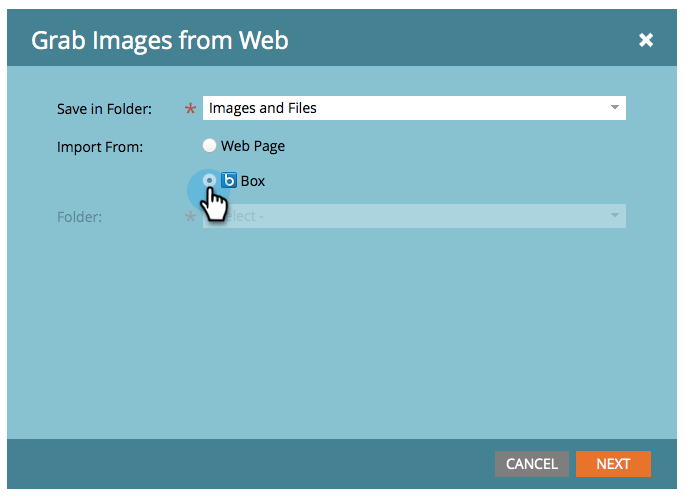

# Överför bilder och filer från ruta {#upload-images-and-files-from-box}

Du kan överföra filer från Box och använda dem på landningssidor och e-postmeddelanden.

1. Gå till **Design** **Studio**.

   

1. Gå till** Bilder och filer**. Klicka på **Filåtgärder** och välj **Hämta bilder från webben**.

   

1. Klicka på **Ruta**.

   

1. Ange din Box-inloggning.

   

1. Tillåt Marketo att få åtkomst till ditt Box-konto.

   

1. Välj var du vill spara filerna. Markera sedan den **Ruta**-mapp som du vill överföra från. Klicka på **Nästa**.

   

1. Markera de filer som du vill överföra. Klicka på **Importera**.

   

Dina filer kan nu användas på dina landningssidor och e-postmeddelanden!