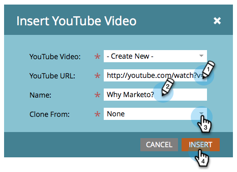

# Lägga till en video på en startsida i frihandsformat {#add-a-video-to-a-free-form-landing-page}

Lägg in videofilmer med alternativ för delning via sociala medier på era landningssidor.

>[!AVAILABILITY]
>
>Alla användare i Marketo Engage har inte köpt den här funktionen. Kontakta kontoteamet (din kontoansvarige) för mer information.

1. Navigera till landningssidan för friformulär och klicka på **Redigera utkast**.

   

1. Dra över **Video** från elementen till höger.

   

1. Välj **Skapa ny** i listrutan.

   

   >[!NOTE]
   >
   >Funktionen **Skapa ny** visas bara i marknadsföringsaktiviteter. Den är inte tillgänglig i Design Studio. Endast redan skapade videor finns i Design Studio. Du kan dock skapa en videoresurs _i ett program_ genom att välja **Nytt** > **Ny lokal resurs**. Du kan sedan välja den i listrutan, vilket visas här.

1. Ange webbadressen till YouTube-videon och ge sedan videon ett namn. Under listrutan Klona från väljer du **Inget** och klickar sedan på **Infoga**.

   

>[!TIP]
>
>Om du vill spara tid kan du använda alternativet **Klona från** för att kopiera alla inställningar från en befintlig videoresurs.

Grattis! Du har lagt till en videodelning på din startsida för fri form. Godkänn landningssidan så spelas din videoresurs upp live. Du kan även [publicera landningssidan på Facebook](/help/marketo/product-docs/demand-generation/facebook/publish-landing-pages-to-facebook.md) eller [lägga videodelningen på din webbplats](/help/marketo/product-docs/demand-generation/social/social-functions/deploy-social-on-your-website.md).

>[!MORELIKETHIS]
>
>Du är klar, men du kan ändra inställningarna för din videodelning om det behövs. Börja med att [anpassa delningsflödet](/help/marketo/product-docs/demand-generation/social/configuring-social-actions/customize-video-share-flow.md) (när och var delningsprompten öppnas).
