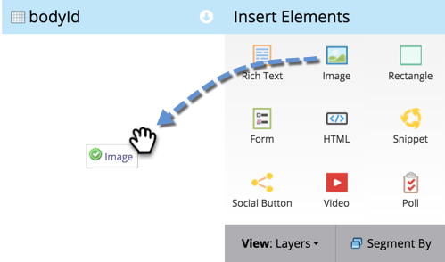

# Lägga till en bild på en landningssida med valfri form {#add-an-image-to-a-free-form-landing-page}

>[!PREREQUISITES]
>
>[Lägg till bilder och filer i Marketo](/help/marketo/product-docs/demand-generation/images-and-files/add-images-and-files-to-marketo.md)

1. Välj en startsida för frihandslandning och klicka på **Redigera** **Utkast**.

   

1. I redigeraren drar du över **Bild** -element.

   

1. Sök efter och välj den bild du vill använda.

   

1. Klicka **Infoga**.

   

   Bra jobbat! Du har just lagt till en bild på din startsida i fri form.

   
