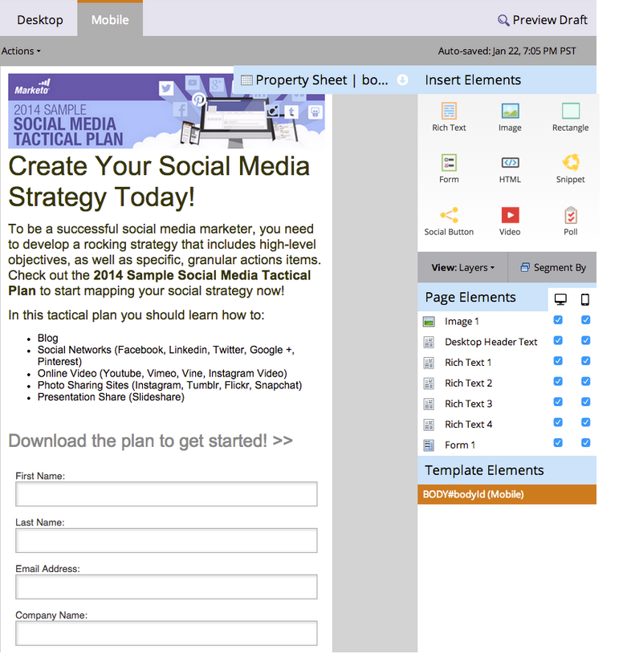

# Anpassa mobilvyn för din startsida med kostnadsfria formulär {#customize-mobile-view-for-your-free-form-landing-page}

>[!PREREQUISITES]
>
>* [Lägg till en mobilvy för din startsida med kostnadsfria formulär](add-a-mobile-view-for-your-free-form-landing-page.md)

>

Mobilvyn på landningssidan i friform är oftast automatisk, men du kan anpassa den. Så här gör du.

1. Välj en startsida för frihandslandning.

   

1. Klicka på **Redigera utkast**.

   

1. Klicka på fliken **Mobil**.

   

## Vyn Mobil jämfört med dator {#mobile-vs-desktop-view}

Under Page Elements visas en -ikon (skrivbord) och en -ikon (mobil). På så sätt kan du visa/dölja olika element dynamiskt.

Som standard visas allt i skrivbordsvyn i mobilvyn.

>[!NOTE]
>
>Rektanglar visas inte i mobilvyn.

## Viktiga saker att veta:  {#important-things-to-know}

* Bilderna utökas till bredden på den mobila enheten. Om du vill ha mindre bilder drar du in textelementet och lägger till bilden därifrån.
* Använd endast Forms 2.0-formulär. De är responsiva och justeras automatiskt.
* Det går bara att redigera ett mallelement, BODY#bodyid (mobil). Du kan använda det här alternativet om du vill ändra bakgrundsfärgen.\
   

## Dölj ett element i mobilvyn {#hide-an-element-from-the-mobile-view}

>[!TIP]
>
>Mindre är mer på mobilen. Använd färre ord för nöjdare kunder.

1. Om du vill dölja ett element klickar du på motsvarande kryssruta under mobilkolumnen.

   

1. Perfekt! Det elementet visas inte längre i mobilvyn.

   

## Lägg till ett element i mobilvyn {#add-an-element-to-the-mobile-view}

>[!TIP]
>
>Gör särskilt (kortare) innehåll bara för mobilvyn.

1. Om du vill lägga till ett element drar och släpper du det på landningssidan för fri form.

   

   Kontrollera att elementet är inställt på att endast visas i mobilvyn.

   

>[!TIP]
>
>Mobilvyn kan också ha olika upplägg av sidelement. Flytta runt saker på startsidan för frihandssidan eller ändra ordning på objekten som listas under **Sidelement** med dra och släpp.

## Förhandsgranska mobilvy {#preview-mobile-view}

1. Klicka på **Förhandsgranska utkast**.

   

1. Vill du se något coolt? Välj **Sida vid sida**.

   

1. Nu kan du se både dator- och mobilversioner av dina landningssidor samtidigt!

   

1. Om du gillar det klickar du på **Godkänn och stäng**.

   

   >[!NOTE]
   >
   >Förhandsgranskningen är inte interaktiv. Alla smarttelefoner visar saker och ting lite annorlunda. Vi rekommenderar att du förhandsgranskar din landningssida på några enheter för att se exakt hur landningssidan fungerar.

Ha det så roligt!

>[!NOTE]
>
>**Relaterade artiklar**
>
>* [Gör en befintlig mall för landningssida i friform kompatibel](../../../../product-docs/demand-generation/landing-pages/landing-page-templates/make-an-existing-free-form-landing-page-template-mobile-compatible.md)

>

