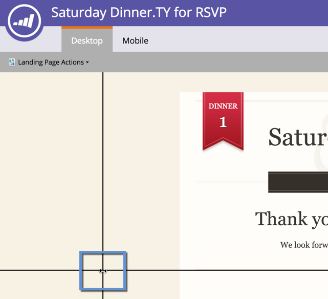

# Använd stödlinjer för landningssiddesign i friform {#use-guides-for-free-form-landing-page-design}

När du utformar en landningssida i fri form kan du använda stödlinjer för att justera komponenterna.

>[!NOTE]
>
>Stödlinjer är bara tillgängliga i **[!UICONTROL Free-form]**-sidredigeraren.

1. Välj en **[!UICONTROL Landing Page]** och klicka på **[!UICONTROL Edit Draft]**.

   

1. Klicka på **[!UICONTROL Landing Page Actions]** och välj **[!UICONTROL Show Guides]**.

   

1. En lodrät och vågrät stödlinje visas över arbetsytan. Flytta dem med markören.

   

1. Dra ett objekt över linjen. Låt gå när linjen dubbleras i bredd och objektet fästs mot stödlinjen.

   

   Justerade objekt är enkla att se!
