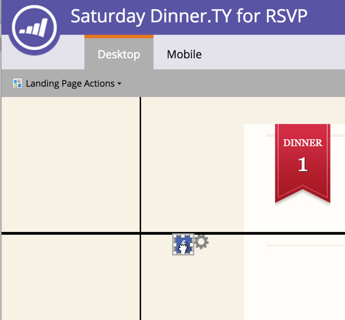

# Använd stödlinjer för landningssiddesign i fritt format {#use-guides-for-free-form-landing-page-design}

När du utformar en landningssida i fri form kan du använda stödlinjer för att justera komponenterna.

>[!NOTE]
>
>Stödlinjer är bara tillgängliga på startsidans **kostnadsfria**-**formulär**-redigerare.

1. Välj en **landningssida** och klicka på **Redigera utkast**.

   

1. Klicka på **Åtgärder för landningssida **och välj **Visa stödlinjer**.

   

1. En lodrät och vågrät stödlinje visas över arbetsytan. Flytta dem med markören.

   

1. Dra ett objekt över linjen. Låt gå när linjen dubbleras i bredd och objektet fästs mot stödlinjen.

   

   Justerade objekt är enkla att se!

