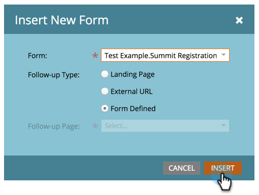

# Lägg till ett formulär på en guidad landningssida {#add-a-form-to-a-guided-landing-page}

Blankett, möt landningssidan. Landningssida, möt formulär.

>[!PREREQUISITES]
>
>[Skapa en guidad landningssida](/help/marketo/product-docs/demand-generation/landing-pages/guided-landing-pages/create-a-guided-landing-page.md)

1. Gå till **Marknadsföringsaktiviteter**.

   

1. Leta reda på och markera landningssidan och klicka på **Redigera utkast**.

   

   >[!NOTE]
   >
   >Tillgängliga element på guidade landningssidor definieras av mallen. Om du inte ser något formulär på elementpanelen väljer du en ny mall eller pratar med den som skapat mallen.

1. Dubbelklicka på **formuläret** på elementpanelen.

   

1. Markera det formulär som du vill lägga till.

   

1. Det finns tre alternativ när du väljer en uppföljningssida:

   * Landningssida - välj en Marketo-landningssida
   * Extern URL - välj en URL
   * Formulärdefinierat - använd de inställningar som har definierats på formulärnivå

   >[!NOTE]
   >
   >Uppföljningssidan är den sida som användarna ser när de har skickat in formuläret.

1. I det här exemplet använder vi Formulärdefinierad. Klicka på **Infoga**.

   

   Snyggt gjort!

   

Stäng nu bara landningssidans redigerare och [godkänn landningssidans utkast](/help/marketo/product-docs/demand-generation/landing-pages/understanding-landing-pages/approve-unapprove-or-delete-a-landing-page.md).
