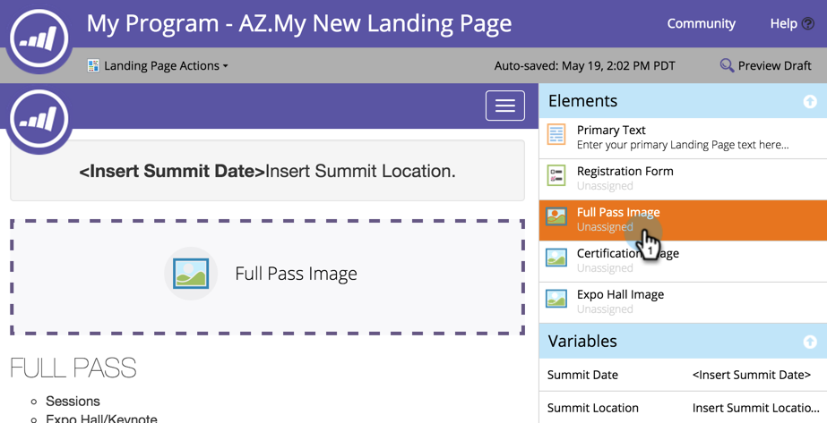

# Lägg till en bild på en guidad landningssida {#add-an-image-to-a-guided-landing-page}

Till skillnad från landningssidor med frihandslingor har stödda landningssidor fördefinierade, låsta utrymmen där du lägger till bilder.

1. Välj en guidad landningssida. Klicka på **Redigera utkast**.

   

1. Klicka på bilden som du vill redigera. Elementplatshållaren lyser på startsidans arbetsyta.

   

1. Markera bilden som du vill ha och klicka på **Infoga**.

   

1. Innehållet visas i platshållaren för elementet.

   >[!NOTE]
   >
   >Hur bildens storlek ändras beror på mallen. Läs mer om [Guided Landing Page Templates](../../../../product-docs/demand-generation/landing-pages/landing-page-templates/create-a-guided-landing-page-template.md).

   

   >[!TIP]
   >
   >Det går för närvarande inte att ange en länk för en bild i redigeraren. Använd ett RTF-element i stället.

