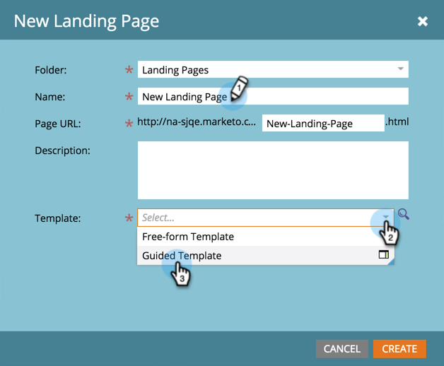
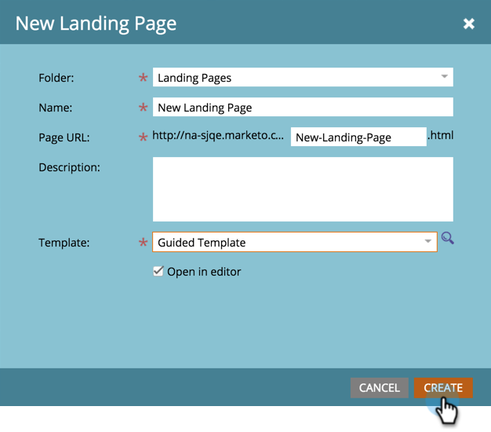

# Skapa en guidad landningssida {#create-a-guided-landing-page}

>[!NOTE]
>
>Lägen för landningssidor definieras av deras mall. [Läs ](/help/marketo/product-docs/demand-generation/landing-pages/understanding-landing-pages/understanding-free-form-vs-guided-landing-pages.md) mer om mallar för frihandsritningar och guidade landningssidor.

>[!PREREQUISITES]
>
>Om du vill använda en anpassad mall måste du först [skapa en guidad landningssidmall](/help/marketo/product-docs/demand-generation/landing-pages/landing-page-templates/create-a-guided-landing-page-template.md).

## Skapa en guidad landningssida i ett program {#create-a-guided-landing-page-in-a-program}

Du kan skapa landningssidor med stödlinjer som lokala resurser i ett program eller i Design Studio som ska användas globalt.

1. Gå till **Marknadsföringsaktiviteter**.

   

1. Välj program.

   

1. Klicka på listrutan **Nytt**. Välj **Ny lokal resurs**.

   

1. Välj **Startsida**.

   

1. Ge landningssidan ett namn. Klicka på listrutan **Mall** och välj **Guidad mall**.

   >[!NOTE]
   >
   >De guidade startsidmallarna har ikonen  bredvid sig. De guidade mallarna är strukturerade så att de kan vara fullt responsiva.

   

## Skapa en landningssida i Design Studio {#create-a-landing-page-in-design-studio}

1. Gå till **Design Studio**.

   

1. Klicka på listrutan **Nytt**. Välj **Ny landningssida**.

   

1. Ge landningssidan ett namn. Klicka på listrutan **Mall** och välj **Guidad mall**.

   

1. Klicka på **Skapa**.

   

>[!TIP]
>
>URL:en skapas automatiskt från program- och landningssidans namn. Om du vill ändra URL-adressen redigerar du fältet **Sida-URL**.
>
>Avmarkera kryssrutan **Öppna i redigerare** om du inte vill att redigeraren ska öppnas omedelbart efter att du klickat på **Skapa**.
