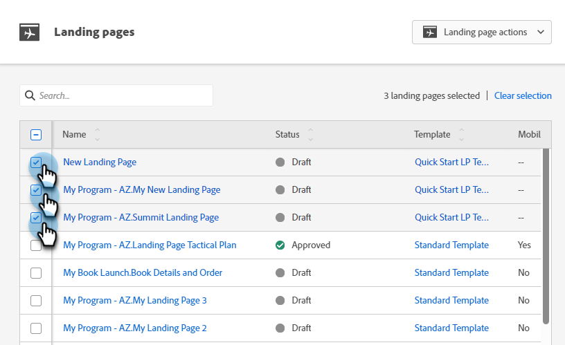

# Godkänn flera landningssidor samtidigt {#approve-multiple-landing-pages-at-once}

1. Gå till **Design Studio**.

   

1. Klicka på **Landningssidor**.

   

1. Välj önskade landningssidor.

   

   >[!TIP]
   >
   >Klicka inte på det faktiska namnet på landningssidan. Det är länkar som tar dig till sidan.

1. Markera dina landningssidor och klicka på listrutan **Åtgärder för landningssida** och välj **Godkänn**.

   

1. Klicka på **Godkänn**.

   

   >[!TIP]
   >
   >Du kan också använda stegen ovan för andra gruppalternativ, till exempel ogodkänna eller ta bort.
