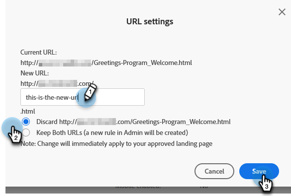

# Ändra URL för landningssida {#change-the-landing-page-url}

Du kan ändra en URL för en landningssida. Det kan göra det enklare att komma ihåg och förbättra webbadressen.

1. Sök efter och välj önskad landningssida.

   

1. Klicka på listrutan **Åtgärder för landningssida**, bläddra till **URL-verktyg** och välj **URL-inställningar**.

   

1. Ange den **nya URL:en**, välj att ta bort eller omdirigera den gamla URL:en och klicka sedan på **Spara**.

   

   >[!NOTE]
   >
   >Om du vill behålla båda URL:erna skapas en omdirigeringsregel automatiskt. Läs mer om [URL-omdirigeringar](/help/marketo/product-docs/demand-generation/landing-pages/personalizing-landing-pages/redirect-a-url-path.md).
