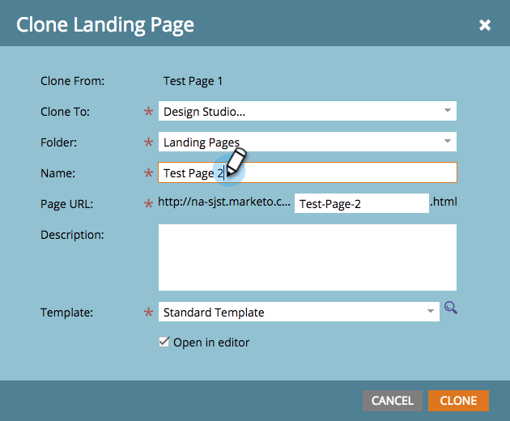

# Klona en testgrupp för landningssidor {#cloning-a-landing-page-test-group}

I Design Studio kan du söka efter och duplicera en testgrupp för landningssidor.

1. Högerklicka på en ej godkänd sida. Välj **Klona**.

   

1. Ge den här klonade sidan ett nytt **namn**. Klonade sidor visas längst ned i den aktuella mappen.

   

1. Skapa nu en ny testgrupp genom att klicka på **Nytt** och välja **Ny testgrupp**.

   

1. I dialogrutan Skapa nya landningssidor anger du den nya testgruppen **Namn**.

   

1. Längst ned i dialogrutan markerar du de klonade sidorna i listan **Tillgängliga landningssidor** och klickar på pilen till höger för att inkludera den i **Testade landningssidor**. Gör detta för alla landningssidor som du vill använda i den här gruppen.

   

1. När du är klar klickar du på **Skapa.**

   

1. När du är redo att starta testgruppen högerklickar du på gruppen i trädet och väljer **Godkänn testgrupp**.

   

   Gruppen kommer nu att aktivt följa upp besök och ifyllningar av formulär så att du kan se vilken landningssida som fungerar bäst.

