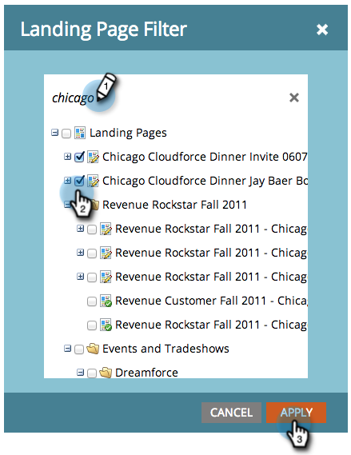

# Filtrera en rapport om landningssidans prestanda {#filter-a-landing-page-performance-report}

Fokusera din [rapport om landningssidans prestanda](/help/marketo/product-docs/demand-generation/landing-pages/understanding-landing-pages/landing-page-performance-report.md) på landningssidor i dina program (lokala resurser), på landningssidor i Design Studio (globala resurser) eller på dem som har arkiverats.

1. Gå till **Analytics** (eller **Marknadsföringsaktiviteter**).

   

1. Välj landningssidrapporten i navigeringsträdet.

   

1. Klicka på fliken **Inställningar** och dra i ett filter.

   

   * **landningssidor för Design Studio:** Globala resurser som hanteras i Design Studio.
   * **Landningssidor för marknadsföringsaktiviteter:** Lokala resurser i program på fliken Marknadsföringsaktiviteter.
   * **Arkiverade landningssidor:** Inaktiva, indragna landningssidor.

1. Välj mappar och specifika landningssidor som ska inkluderas i rapporten.

   

   >[!TIP]
   >
   >Om du väljer en mapp innehåller rapporten allt som finns i mappen när rapporten körs.

1. Du är klar! Klicka på fliken **Rapport** för att visa den filtrerade rapporten.

   
