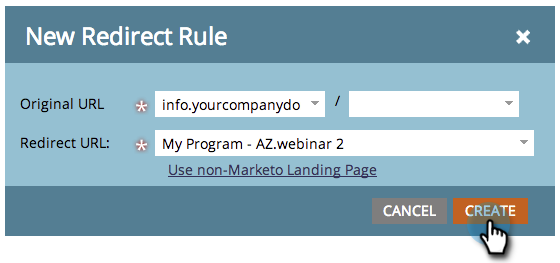

# Dirigera om en markering till landningssida till en annan sida {#redirect-a-marketo-landing-page-to-another-page}

Om du någonsin uppdaterar en sidas URL och vill att den gamla URL:en ska fungera, kan du försöka med en omdirigering! Det är enkelt att ställa in den.

>[!NOTE]
>
>**Administratörsbehörigheter krävs**

1. Under **Admin** klickar du på **Landning** **Sidor**.

   

1. Under fliken **Regler** klickar du på **Nytt** och sedan på **Nytt** **Omdirigering** **Regel**.

   

1. Klicka på listrutan **first** **Original** **URL** och välj din Marketo [CNAME](customize-your-landing-page-urls-with-a-cname.md).

   

   >[!NOTE]
   >
   >**Påminnelse**
   >
   >
   >Kom ihåg att du bara kan omdirigera URL:er som börjar med din Marketo [CNAME](customize-your-landing-page-urls-with-a-cname.md).

1. Välj den landningssida som du vill omdirigera i det **andra ursprungliga URL-fältet**.

   

   >[!NOTE]
   >
   >Du kan ange valfri URL-sökväg, även om sidan eller katalogen inte finns.

1. Klicka på listrutan **Omdirigering** **URL** och välj sidan som du vill omdirigera besökare till.

   

1. Klicka på **Skapa**.

   

   >[!TIP]
   >
   >Om du vill omdirigera till en webbsida utanför Marketo klickar du på **Använd icke-Marketo Landing Page**.

   >[!NOTE]
   >
   >**Relaterade artiklar**
   >
   >    
   >    
   >    * [Omdirigera en URL-sökväg](../../../../product-docs/demand-generation/landing-pages/personalizing-landing-pages/redirect-a-url-path.md)

Snygga till klackarna, Marketing Hero, du är klar!