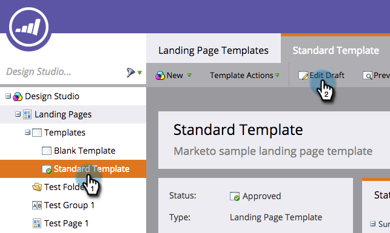

# Redigera en mall för landningssida för Marketo {#edit-a-marketo-landing-page-template}

Du kan redigera alla landningssidmallar i Marketo.

1. Gå till **Design Studio**.

   

1. Expandera **landningssidor** för att visa mallarna.

   

1. Markera den **mall** som du vill redigera. Klicka på** Redigera utkast**.

   

   Klart! Nu kan du redigera CSS för mallen och ha full kontroll över dess utseende och layout.

   >[!NOTE]
   >
   >När du redigerar en mall för landningssidor skapas ett utkast av alla resurser på landningssidan med den mallen.

