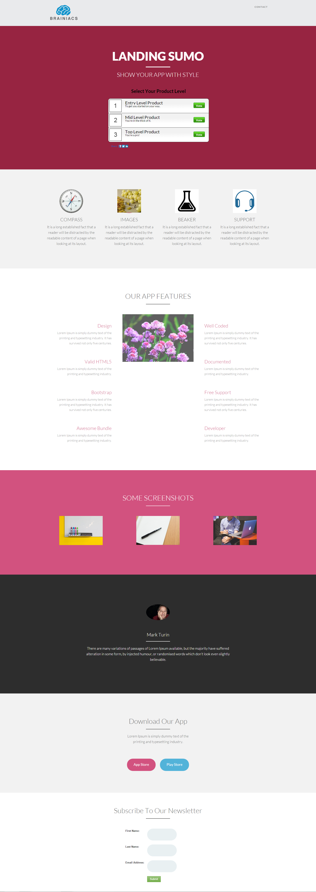

# Mall 14-C {#template-c}

Högerklicka för att [hämta mall 14-C](http://docs.marketo.com/download/attachments/9437807/template-14c.html?version=1&amp;modificationdate=1438980264000&amp;api=v2)

Den här mallen innehåller följande innehåll:

* En rubrik (valfritt)
* Ett primärt avsnitt

   * innehåller hjältetitel, hjältetext och enkät

* Viktiga avsnitt (valfritt)
* Sidfot (valfritt)

Högerklicka nedan om du vill hämta den här mallen:

[Template14-C.html](http://docs.marketo.com/download/attachments/9437807/template-14c.html?version=1&amp;modificationdate=1438980264000&amp;api=v2)
