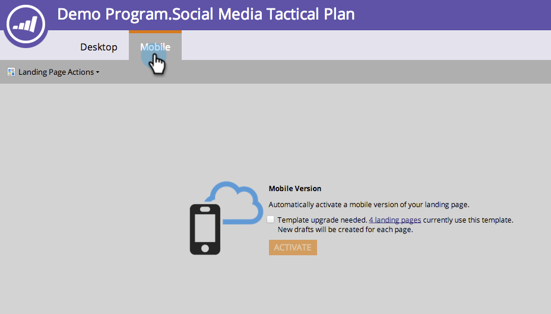

# Gör en befintlig mall för landningssida i friform kompatibel {#make-an-existing-free-form-landing-page-template-mobile-compatible}

>[!NOTE]
>
>Mallar för landningssidor som skapades före [januari 2015](../../../../release-notes/2015/release-notes-january-2015.md)måste uppgraderas för att vara mobilkompatibla.

Det kan du göra på två ställen: mallredigeraren och redigeraren för landningssidor.

## Uppgradera från mallredigeraren {#upgrade-from-the-template-editor}

1. Gå till **Design Studio**.

   

1. Välj **Mallar**.

   

1. Välj en mall där **Mobile Compatible** är **No**.

   

1. Klicka på **Redigera utkast**.

   

1. Klicka på **Gör mobilkompatibel**.

   

1. Klicka på **Uppgradera**.

   

   Din landningssidmall är nu mobilkompatibel.

   >[!NOTE]
   >
   >Uppgraderingen bör vara ofarlig, men kontrollera om det finns några skillnader på sidorna. Uppgraderingen kommer att skapa utkast av landningssidor med den mallen.

   

## Vad gör en mall för mobil kompatibel? {#what-makes-a-template-mobile-compatible}

Fantastiska frågor! Mallen måste ha följande taggar:

`<pre data-theme="Confluence">Must have <!DOCTYPE HTML> Must have a <HEAD> element Must have a <TITLE> in the <HEAD> element Must have <META CHARSET="UTF-8"> within the <HEAD> element Must have a <BODY> element that contains one (and only one) 

</pre>`  Om allt ser bra ut ser du det här meddelandet.

Om något är fel visas ett felmeddelande. Klicka på Reparera för att åtgärda problemet och upprepa valideringsprocessen.

Om du gör några ändringar i mallen klickar du på Mallåtgärder och väljer Validera mobilkompatibilitet.

## Uppgradera en mall från sidredigeraren för kostnadsfri landning {#upgrading-a-template-from-the-free-form-landing-page-editor}

När du redigerar en landningssida och klickar på mobilfliken, kommer du ibland att märka att mallen inte har uppgraderats. Rädsla inte! Där kan du uppgradera den.

1. Klicka på fliken **Mobil** .

   

1. Klicka på kryssrutan och klicka på **Aktivera**.

   

   >[!NOTE]
   >
   >När du aktiverar mobilversionen av en mall skapas utkast för alla landningssidor som använder den.

Häftig! Nu kan du [anpassa mobilvyn](../../../../product-docs/demand-generation/landing-pages/free-form-landing-pages/customize-mobile-view-for-your-free-form-landing-page.md) för alla dina landningssidor som använder den här mallen.

>[!MORELIKETHIS]
>
>* [Anpassa mobilvyn för din startsida med kostnadsfria formulär](../../../../product-docs/demand-generation/landing-pages/free-form-landing-pages/customize-mobile-view-for-your-free-form-landing-page.md)

>

