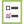

# Förstå element och variabler i guidade mallar {#understanding-elements-and-variables-in-guided-templates}

Det finns två typer av redigerbara sektioner i mallar för guidade landningssidor: element och variabler.

## Element  {#elements}

Elementen är de olika innehållsdelar som utgör en landningssida. De kan vara bilder, text eller Marketo-resurser.

När du redigerar en guidad landningssida visas elementen om de har markerats som redigerbara i mallen. Elements kommer att ha följande ikoner:

*  Bild
* Marketo Form
* Text
* Video
* Marketo Share Button
* Marketo Poll
* Marketo Referral
* Marketo Sweepstakes
* Marketo-kodfragment

Variabler

Variabler är tokenliknande attribut som kan anpassas från den guidade redigeraren på landningssidan, som visas nedan.

Det finns tre typer av variabler: strängvariabler, färgvariabler och booleska variabler.

<table> 
 <tbody> 
  <tr> 
   <td>Sträng</td> 
   <td>
Redigerbar text

Exempel: Titlar, datum, knappetiketter
</td> 
  </tr> 
  <tr> 
   <td>Färg</td> 
   <td>
Redigerbar hexkod för färg

Exempel: Bakgrundsfärg, teckensnittsfärg, kantfärg
</td> 
  </tr> 
  <tr> 
   <td>Boolean</td> 
   <td>
En spake som styr läge på/av för objekt eller format på landningssidan

Exempel: Visa sidfot (Ja/Nej), Antal kolumner (1/2), Bädda in Google Analytics (sant/falskt)
</td> 
  </tr> 
 </tbody> 
</table>

>[!NOTE]
>
>**Relaterade artiklar**
>
>[Skapa en mall för guidad landningssida](create-a-guided-landing-page-template.md)

